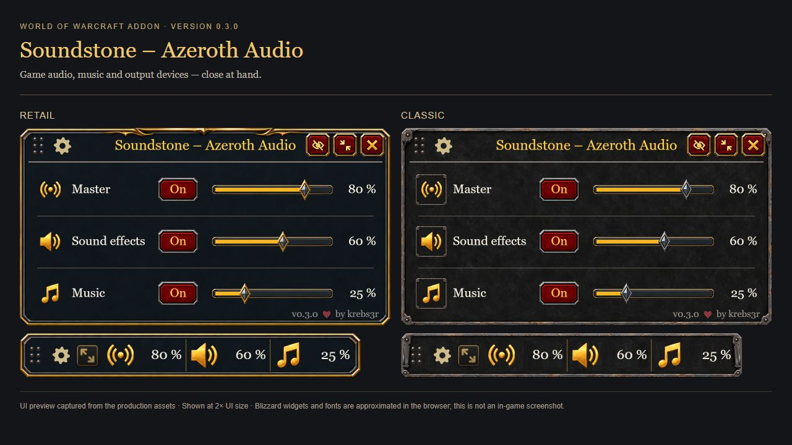
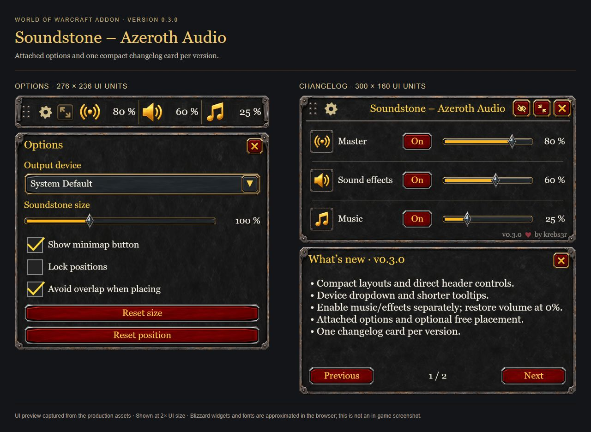

<p align="center">
  
</p>

<h1 align="center">Soundstone – Azeroth Audio</h1>

A compact World of Warcraft addon for **master volume, sound effects and music**. Switch between a quick bar and an expanded mixer, select WoW's output device and keep audio controls within reach. English and German UI; no other addon required.

**[Download Soundstone 0.3.0](https://github.com/krebs3r/soundstone-azeroth-audio/releases/download/v0.3.0/Soundstone-0.3.0.zip)** · [Release notes](https://github.com/krebs3r/soundstone-azeroth-audio/releases/tag/v0.3.0) · [Deutsche Anleitung](docs/ANLEITUNG-DE.md)



*Current UI-preview captures using the actual addon textures. Blizzard widgets and fonts are approximated in the browser; these are not in-game screenshots.*

## Why I created Soundstone

I sometimes watch Netflix, YouTube or another streaming service on my second monitor while playing WoW. I created Soundstone so I could quickly mute or adjust game sound and music without opening the full audio settings every time.

## Installation

1. Download **`Soundstone-0.3.0.zip`** from the release's **Assets** section. Choose this installable ZIP, not GitHub's automatically generated **Source code** archives.
2. Close WoW and extract the ZIP. It contains one folder named **`Soundstone`**.
3. Copy that folder into **`Interface/AddOns` inside the WoW client you play**:

   | Client | Destination relative to your World of Warcraft directory |
   | --- | --- |
   | Retail / Midnight | `_retail_/Interface/AddOns/Soundstone/` |
   | Mists of Pandaria Classic | `_classic_/Interface/AddOns/Soundstone/` |
   | TBC Classic Anniversary | `_anniversary_/Interface/AddOns/Soundstone/` |
   | Classic Era / Hardcore / Season of Discovery | `_classic_era_/Interface/AddOns/Soundstone/` |

4. Check the final path: **`Interface/AddOns/Soundstone/Soundstone.toc`**. There must not be an extra ZIP/repository folder or a second nested `Soundstone` folder.
5. Start WoW, enable **Soundstone – Azeroth Audio** in the **AddOns** list, and enter the world. Use **`/soundstone`** or the minimap button to open it.

**Updating:** close WoW, replace the existing `Soundstone` addon folder with the new one and restart. Keep your `WTF` folder; it contains saved preferences. For an update already copied while playing, `/reload` reloads the addon. Restart the client if it does not discover a newly installed addon.

**Can't see it?** Try `/soundstone show`, even when the minimap button is disabled. The release also provides a SHA-256 file for optional ZIP integrity checking.

## Controls

| Action | Result |
| --- | --- |
| Left-click an audio icon or On/Off button | Toggle that audio group |
| Right-click a compact audio icon | Open the expanded mixer |
| Wheel over an icon or slider | Change volume by 5%; Shift + wheel changes 1% |
| Drag a volume slider | Set the volume from 0–100% |
| Gear / view arrows | Open options / switch compact and expanded views |
| Crossed-out eye | Hide Soundstone; restore with `/soundstone` |
| Red X / Escape | Close the current popup, then return from mixer to compact view |
| Drag the six-dot grip or mixer title | Move Soundstone unless positions are locked |
| Minimap left-click / right-click | Restore or switch view / show or hide Soundstone |

### Audio behavior

Turning **Master** off makes every group appear off while preserving its settings. Enabling **Music** with master off activates only music; enabling **Sound effects** instead activates that group alone. Sound effects includes effects, ambience and dialogue; voice chat remains separate. The effects slider adjusts the three grouped volumes together.

Enabling at **0%** restores the last positive volume. Muting preserves volume levels; dragging a muted slider does not unmute it. Gray icons indicate inactive audio. Percentages show configured channel volumes, not measured output. WoW's audio settings remain the source of truth; startup never applies default volumes.

### Layout and options

The compact bar is **276 × 36**, the mixer **300 × 160**, and options **276 × 236** UI units. The footer displays the version. Starting with 0.3.2, release notes are kept outside the addon in [CHANGELOG.md](CHANGELOG.md) and on the release page.

Soundstone follows WoW's UI scale and adds its own **75–150%** size setting. Size changes apply when the slider is released. Options attach below the current view, or above near the bottom screen edge. The views share a saved position; minimap visibility is independent.

**Avoid overlap when placing** finds a free position beside visible, readable UI controls when a drag ends. It does not reserve space against later-opening windows or inaccessible frame bounds. Turn the option off for unrestricted placement.

The device field opens an attached, scrollable dropdown. Selection is validated and read back; successful changes restart WoW's audio system once. Unsupported APIs and rejected changes are reported rather than displayed as successful selections.



*Historical 0.3.0 browser preview of options and release notes. The release-notes window is removed in 0.3.2.*

### Commands and bindings

Both `/soundstone` and `/azeraudio` accept:

```text
compact / expand      Choose a view
hide / show / bar     Hide, restore or toggle visibility
minimap               Toggle the minimap button
lock / reset          Lock positions or reset them
scale 100             Set addon size (75–150%)
master 70             Set master volume to 70%
sfx off               Mute effects, ambience and dialogue
music on              Enable music; restore volume if needed
music toggle          Toggle music
help                  Show command help
```

Optional bindings are available under **Soundstone – Azeroth Audio** in WoW's Key Bindings menu. No keys are assigned automatically.

## Client compatibility

Targets checked on 15 September 2026: **Retail 12.1.0**, **MoP Classic 5.5.4**, **TBC Anniversary 2.5.6**, and **Classic Era 1.15.9** (including its Hardcore/Season of Discovery family). One installable package includes their Interface entries.

These targets do not mean that every client and game mode has passed in-game acceptance. The automated suite uses simulated APIs. **WoW: Forever is unconfirmed**, and future patches may require updates. See the [compatibility audit](docs/COMPATIBILITY.md) and [validation status](docs/TESTING.md).

## Development

Runtime code is Lua 5.1 compatible. Development uses Python 3.10+ and the packages in `requirements-dev.txt`:

```sh
python -m pip install -r requirements-dev.txt
python tests/run.py
python tools/preview.py
python tools/package.py
```

The test suite runs **711 scenarios** across five simulated client/API configurations, each with native and fallback dropdown menus. Packaging checks TOC entries, XML, all 24 textures, shared header bounds and ZIP integrity. The result is `dist/Soundstone-0.3.0.zip` with one installable `Soundstone/` folder.

Serve `docs/` locally to inspect `ui-preview.html`, `readme-gallery.html` and `readme-details.html`. The gallery captures use the same production-asset renderer. Graphic export is available in `tools/export-assets.ps1`; the earlier approved concept remains in [design-concept.png](docs/design-concept.png).

GitHub Actions validates pushes and pull requests. A matching version tag builds and publishes a prerelease using the GitHub CLI; promoting a tested release is an explicit publication step.

## CurseForge publication and local installation

See the [CurseForge setup and release guide](docs/curseforge/README.md) for automatic uploads after a regular GitHub release is approved, the in-game acceptance checklist, and the local multi-client installer. Use `python tools/install-local.py --all --status` to compare installed copies and `--all --install` to install the validated ZIP with backups (close WoW first).

## License

MIT-licensed code. See [LICENSE](LICENSE) and [artwork provenance](docs/ARTWORK.md). Soundstone is an independent community addon, not an official Blizzard product.
