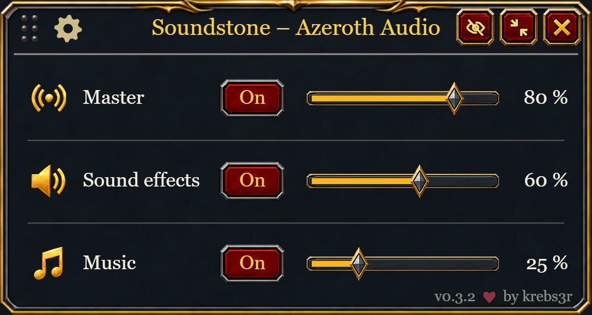
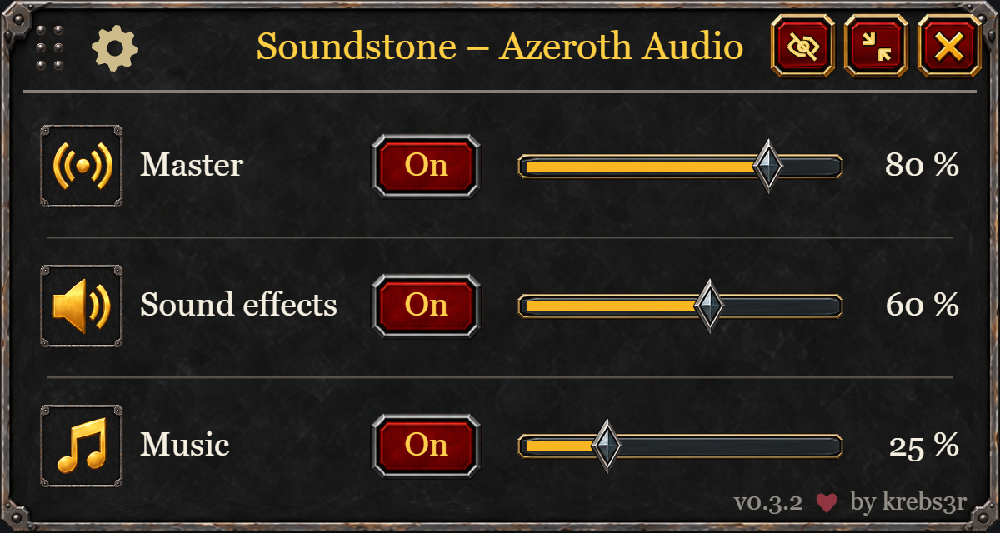
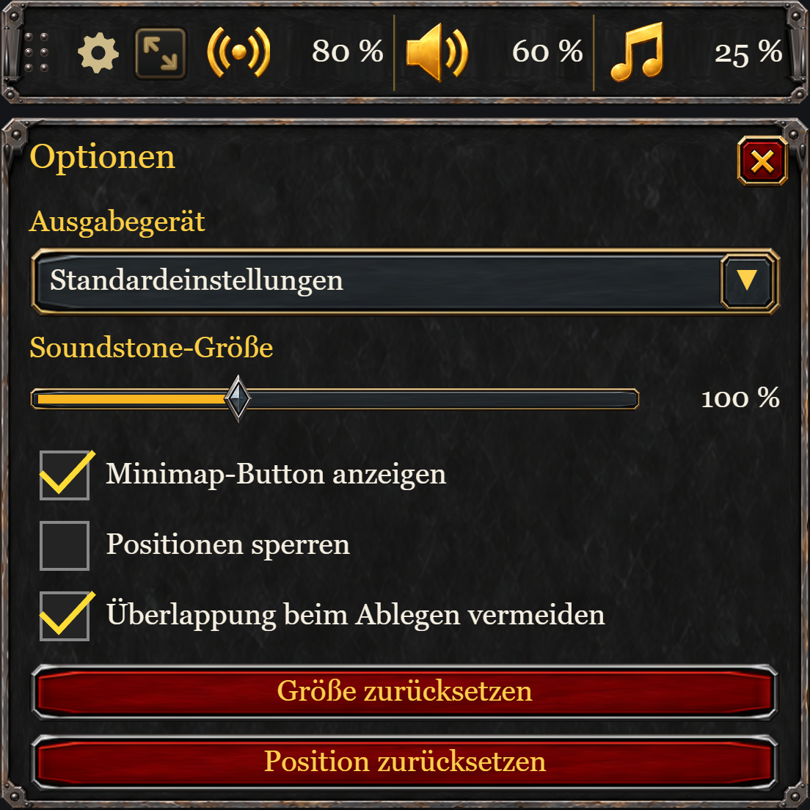

# Soundstone – Azeroth Audio

**Your game. Your sound.**

Control your World of Warcraft audio in one compact window. Soundstone keeps master volume, sound effects, music and your output device within reach, with a quick bar and an expanded mixer. No additional addons are required.

[Download on CurseForge](https://www.curseforge.com/wow/addons/soundstone-azeroth-audio) · [GitHub Releases](https://github.com/krebs3r/soundstone-azeroth-audio/releases) · [Deutsche Anleitung](docs/ANLEITUNG-DE.md) · [Report an issue](https://github.com/krebs3r/soundstone-azeroth-audio/issues)

## Why I built Soundstone

I sometimes watch Netflix, YouTube or another streaming service on my second monitor while playing WoW. I wanted to quickly mute or adjust game sound and music without opening the full audio settings every time, so I built Soundstone to keep those controls within reach.

Soundstone shares its visual style with [Hourstone – Azeroth Hours](https://github.com/krebs3r/hourstone-azeroth-hours), with frames for Retail and Classic.

## Features

- Master volume, sound effects and music, with individual toggles and sliders.
- A compact bar for quick access and an expanded mixer for finer control.
- Mouse-wheel volume control; hold Shift for smaller steps.
- Audio output selection when supported by your WoW client.
- A movable, resizable window with saved position, position locking and optional overlap avoidance.
- An entry in the Retail Addons menu below the clock, an optional minimap button and keyboard shortcuts.
- German interface on German clients, English on all others.

## Interface previews

Design previews of the 0.3.2 interface, not in-game screenshots; fonts and controls may differ.

### Retail

### Classic

### Compact bar and settings

## Supported clients

These versions have been tested in game:

| WoW client | Soundstone download |
| --- | --- |
| Retail (12.1.0) | [0.3.2](https://github.com/krebs3r/soundstone-azeroth-audio/releases/download/v0.3.2/Soundstone-0.3.2.zip) |
| Mists of Pandaria Classic (5.5.4) | [0.3.2](https://github.com/krebs3r/soundstone-azeroth-audio/releases/download/v0.3.2/Soundstone-0.3.2.zip) |
| Burning Crusade Classic Anniversary (2.5.6) | [0.3.2](https://github.com/krebs3r/soundstone-azeroth-audio/releases/download/v0.3.2/Soundstone-0.3.2.zip) |
| Classic (1.15.9) | [0.3.2](https://github.com/krebs3r/soundstone-azeroth-audio/releases/download/v0.3.2/Soundstone-0.3.2.zip) |

Classic Era, Hardcore and Season of Discovery share the Classic client. The Classic test confirms client compatibility; individual game modes have not been tested separately. Choose a download marked for your client on CurseForge.

## Installation

Install **Soundstone – Azeroth Audio** through the CurseForge app for your WoW client.

For manual installation:

1. Download the Soundstone ZIP for your client from the table above or [CurseForge](https://www.curseforge.com/wow/addons/soundstone-azeroth-audio/files).
2. Close WoW and extract the `Soundstone` folder into that client's `Interface/AddOns` folder.
3. Start WoW, enable Soundstone in the AddOns list and enter `/soundstone`.

The final path should be `Interface/AddOns/Soundstone/Soundstone.toc`. Repeat for each WoW installation you use.

**Updating manually:** close WoW and replace the `Soundstone` folder. Keep your `WTF` folder to preserve saved preferences.

## Quick start

| Control | Action |
| --- | --- |
| `/soundstone`, Addons menu or minimap left-click | Open Soundstone or switch between compact bar and mixer |
| Right-click in the Addons menu or on the minimap button | Show or hide Soundstone |
| Audio icon or On/Off button | Mute or unmute that audio group |
| Mouse wheel over an icon or slider | Change volume by 5%; Shift + wheel changes 1% |
| Volume slider | Set volume from 0–100% |
| Gear button | Choose output device, size, minimap visibility and placement settings |
| View arrows or right-click a compact audio icon | Switch views or open the mixer |
| Six-dot grip or mixer title | Drag the window |
| Crossed-out eye | Hide Soundstone; restore it with `/soundstone show` |
| Escape | Close the current menu or return to the compact bar |

Use `/soundstone help` for all commands. `/azeraudio` works as an alias. Optional shortcuts are available under **Soundstone – Azeroth Audio** in WoW's Key Bindings menu.

### Audio and layout tips

**Sound effects** groups effects, ambience and dialogue. Voice chat remains separate. Soundstone uses your current WoW audio settings when you log in.

Muting preserves your volume levels. Enabling a group at 0% restores its last positive volume; moving a muted slider does not unmute it. With Master off, enabling Music or Sound effects activates just that group.

Set the window size from **75–150%** in the gear menu. **Avoid overlap when placing** helps find space when you move the window or expand the mixer. Turn it off if you prefer unrestricted placement.

## Feedback and more

Found a problem? [Open an issue](https://github.com/krebs3r/soundstone-azeroth-audio/issues) with your WoW client version, Soundstone version and the steps to reproduce it. Include a screenshot or Lua error message if available.

[Release history](CHANGELOG.md) · [Deutsche Anleitung](docs/ANLEITUNG-DE.md) · [Development](docs/DEVELOPMENT.md)

## License and artwork

[MIT](LICENSE), © 2026 krebs3r. See [artwork provenance](docs/ARTWORK.md). World of Warcraft is a trademark of Blizzard Entertainment; Soundstone is an independent community addon.
