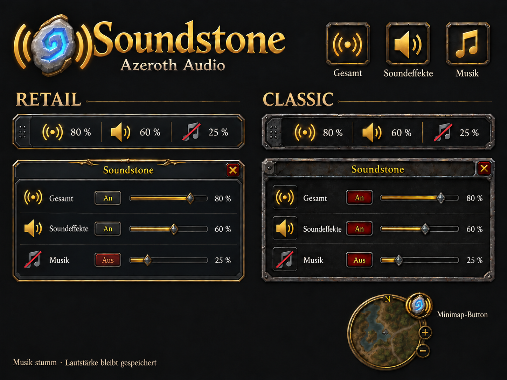

# Soundstone – Azeroth Audio

A small World of Warcraft addon for **master volume, sound effects and music**, with a movable compact bar, an expanded mixer, output-device selection and a minimap button. German and English UI. No other addon required.

## Why I created Soundstone

I sometimes watch Netflix, YouTube or another streaming service on my second monitor while playing WoW. I created Soundstone so I could quickly mute or adjust game sound and music without opening the full audio settings every time.



The image above is the approved design reference. Version 0.2 uses custom Retail and Classic frame textures, proportional alpha icons, six grip dots, red close buttons and diamond slider thumbs derived from that reference. [Production-asset preview](docs/ui-preview.html) and [validation status](docs/TESTING.md) distinguish the reference from tested in-game rendering.

## Install

1. Download `Soundstone-0.2.0.zip` from the release or supplied build.
2. Extract the **Soundstone** folder into your client's `Interface/AddOns` directory.
3. Confirm that `Interface/AddOns/Soundstone/Soundstone.toc` exists, without a second nested Soundstone folder.
4. If WoW was already running, try `/reload`. If the new addon is not discovered, restart the client. Enable **Soundstone – Azeroth Audio** in the AddOns list.
5. Enter the world and use `/soundstone` or `/azeraudio`.

| Client family | Folder | Target patch | Interface |
| --- | --- | --- | --- |
| Retail / Midnight | `_retail_` | 12.1.0 | 120100 |
| Mists of Pandaria Classic | `_classic_` | 5.5.4 | 50504 |
| Burning Crusade Classic Anniversary | `_anniversary_` | 2.5.6 | 20506 |
| Classic Era, Hardcore, Season of Discovery | `_classic_era_` | 1.15.9 | 11509 |

These are target clients, not a claim that all four have passed in-game tests. See [validation status](docs/TESTING.md). Future patches may require updated Interface metadata and API checks. WoW: Forever is **not yet verified** and is not advertised as supported.

## Controls

| Action | Result |
| --- | --- |
| Left-click a quick-bar icon | Toggle that channel |
| Right-click an audio icon | Switch to expanded view |
| Click the six-dot grip / expanded title menu | Options and output device |
| Wheel over an icon or slider | Change volume by 5 percentage points |
| Shift + wheel | Change volume by 1 percentage point |
| Drag a slider | Set 0–100%, in 1% steps |
| Drag the bar grip or mixer title | Move the shared position, unless locked |
| Minimap left-click | Switch compact / expanded view |
| Minimap right-click | Show/hide Soundstone |
| Drag minimap button | Move around the minimap, unless locked |
| Options | Output device, size, minimap visibility, position lock/reset |
| Red X | Return to compact view |
| Escape | Close device list, then options, then return to compact view |

Optional bindings are available in WoW's Key Bindings menu under **Soundstone – Azeroth Audio**. No keys are assigned automatically.

### Audio behavior

- Master uses WoW's master volume and main sound switch, affecting all game audio routed through that channel. It leaves individual volumes and mute choices unchanged.
- Sound effects uses the SFX channel. Music has its own channel. Ambience and dialogue keep their separate WoW settings.
- **Mute never replaces the saved volume with zero.** Percentages show the configured channel value, not measured sound output. Master 50% and music 50% continue to display those two values separately.
- Moving a muted channel's slider does not unmute it. A crossed icon can also mean that master is off or at 0%; its tooltip explains why.
- The client audio settings remain the source of truth. Soundstone reads them on login, on relevant CVar events and when opening the mixer. It does not apply default audio volumes at startup.
- View, shared position, Soundstone size, minimap position and visibility are saved per WoW account within each client installation. Existing 0.1 bar position and visibility migrate automatically. No cross-client file synchronization is performed.
- There is no continuous update loop while idle. The minimap drag uses one only while dragging.

### Output devices and size

The options menu lists WoW's game-audio output devices, including the system-default entry supplied by the client. Selecting a different available device updates WoW's output setting and restarts its audio system once. It does not change stored channel volumes or mute switches. Device lists refresh when opened and when WoW reports a device update; stale selections are rejected. Names can be read in full in tooltips, and longer device lists scroll with the mouse wheel.

The compact bar is 300 × 45 UI units; expanded view is 300 × 160. The options size slider adds 75–150% scaling (default 100%) on top of WoW's UI scale. The minimap button follows the minimap. Frame corners are sliced separately, and icons preserve their source proportions.

### Slash commands

`/soundstone` and `/azeraudio` switch views and show Soundstone if hidden. Both accept:

```text
compact               Show compact view
expand                Show expanded view
bar                   Show/hide Soundstone
minimap               Toggle minimap button
lock                  Lock/unlock positions
reset                 Reset positions only
scale 100             Set Soundstone size (75–150%)
help                  Show command help
master 70             Set master to 70%
sfx off               Mute sound effects
music on              Enable music (master can still be off)
music toggle          Toggle music
```

## Development

Code is Lua 5.1 compatible. The addon has no external runtime dependencies. Development tests use Python 3.10+ and `lupa==2.8`:

```sh
python -m pip install -r requirements-dev.txt
python tests/run.py
python tools/package.py
```

`tools/package.py` checks TOC entries, XML, texture metadata, true alpha and package contents. It builds `dist/Soundstone-0.2.0.zip` containing one installable `Soundstone/` folder. Tests, source artwork and development files are excluded from the game ZIP.

On Windows, `tools/export-assets.ps1` slices and packages the generated source sheets into alpha textures and writes their Lua coordinates. Run `python tools/preview.py` to rebuild the HTML preview from those same assets.

On GitHub, the CI workflow runs the Lua scenarios and package checks for pushes and pull requests. To publish a release ZIP, push a tag matching the TOC version, for example `v0.2.0`; the release is initially marked as a prerelease until in-game coverage is complete.

## License and artwork

Code is provided under the MIT license. See [LICENSE](LICENSE) and [asset provenance](docs/ARTWORK.md). This is an independent community addon, not an official Blizzard product.

## Deutsch

Eine ausführliche deutsche Installations- und Bedienungsanleitung findest du in [ANLEITUNG-DE.md](docs/ANLEITUNG-DE.md).
